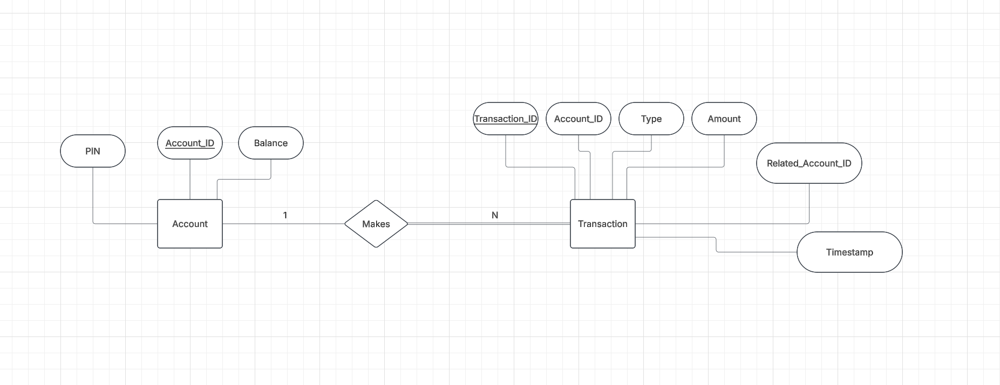

# Bank of CLI

A terminal-based banking application built with Java, Maven, and PostgreSQL.
See [P0-Instructions.md](P0-Instructions.md) for the full project spec.

## Features

- **Register / Login** with a unique Account ID and 4-digit PIN
- **Check balance**
- **Deposit / Withdraw**, with overdraft prevention enforced atomically in the database
- **Transfer** funds between two accounts, atomic (all-or-nothing)
- **Transaction history** for the logged-in account
- **Change PIN**
- **Delete account** (only once the balance is exactly `$0.00`, so funds can never silently vanish)
- `INFO`/`ERROR` audit logging for every action, written to `logs/application.log`

## Architecture

Three layers, each only talking to the one below it:

```
api/            Console UI (Main.java wires everything up, BankREPL.java is the menu loop)
  |
service/        Business rules (PIN checks, overdraft prevention, atomic transfers)
  |
persistence/    JDBC/SQL (DAO pattern — the only layer that talks to Postgres)
  |
domain/         Plain data classes shared across all layers (Account, Transaction)
exception/      Custom exceptions (business-rule failures vs. unexpected DB failures)
```

- `service/` methods only call `persistence/` interfaces (`AccountDAO`, `TransactionDAO`), never JDBC directly.
- `persistence/` classes are the only place `java.sql.*` types appear.
- Errors are split into two families: `BankingException` subtypes (`InvalidPinException`,
  `InsufficientFundsException`, `AccountNotFoundException`, `AccountNotEmptyException`,
  `InvalidTransactionException`) are expected business failures shown to the user as a friendly
  message; `DataAccessException` wraps unexpected database failures, which get logged with full
  detail but shown to the user only as a generic "Service unavailable" message.

## ERD Diagram




## Building, testing, and running

```
mvn compile      # compile the project
mvn test         # run the JUnit 5 test suite
mvn package      # build a runnable, dependency-bundled jar into target/
java -jar target/bankofcli.jar   # run the app (Postgres must be up first)
```

## Testing strategy

- **`persistence/` tests** run against the real database each test cleans up its own data afterward.
- **`service/` tests** use Mockito to mock `AccountDAO`/`TransactionDAO`/`ConnectionFactory`

## Logging

Configured in `src/main/resources/logback.xml`. Logs go only to `logs/application.log`